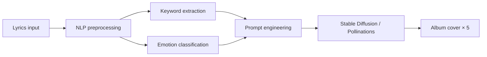

<div align="center">

# LyricVision

**Turn lyrics into album covers — compare five NLP-to-image pipelines side by side.**

[](https://aarushkandukoori.github.io/LyricVision/)
[](backend/)
[](frontend/)
[](LICENSE)

[Try it live](https://aarushkandukoori.github.io/LyricVision/) · [Report bug](https://github.com/aarushkandukoori/LyricVision/issues) · [ArtML source](https://github.com/CodingGenius14/ArtML)

</div>

---

LyricVision is a web app built for **ArtML** — an iterative NLP + generative AI pipeline that translates song lyrics into album cover art. Paste any lyrics and instantly compare how five evolving pipeline versions (V1–V5) interpret the same text into visual prompts and generated images.

## Live demo

**https://aarushkandukoori.github.io/LyricVision/**

No install required — runs entirely in your browser on GitHub Pages.

## How it works



Each pipeline version uses a different prompt strategy:

| Version | Source notebook | What it does |
|:-------:|:----------------|:-------------|
| **V1** | `main.ipynb` | Generic emotion + keyword prompt |
| **V2** | `improved_main.ipynb` | Cinematic style direction |
| **V3** | `improved_main.ipynb` | Emotion-weighted color palette |
| **V4** | `improved_main.ipynb` | Narrative-driven composition |
| **V5** | `final_implementation.ipynb` | Full pipeline — genre bias, visual metaphors, negative prompts, section-weighted emotions |

## Features

- **Side-by-side comparison** — all five versions from a single lyrics input
- **Expandable prompts** — inspect the exact positive/negative prompts each version produces
- **Emotion & genre tags** — see what the NLP layer detected
- **Reproducible seeds** — lock a seed for consistent re-runs
- **Two run modes**
  - **Browser** (GitHub Pages) — client-side NLP + [Pollinations](https://pollinations.ai) image API
  - **Local server** — full Python pipeline with optional local Stable Diffusion 1.5

## Quick start (local)

```bash
git clone https://github.com/aarushkandukoori/LyricVision.git
cd LyricVision
chmod +x scripts/run.sh
./scripts/run.sh
```

Open **http://127.0.0.1:8000**

### Development mode

**Backend** (terminal 1):
```bash
cd backend
python3 -m venv .venv && source .venv/bin/activate
pip install -r requirements.txt
uvicorn app.main:app --reload --port 8000
```

**Frontend** (terminal 2):
```bash
cd frontend
npm install && npm run dev
```

Open **http://127.0.0.1:5173**

## Project structure

```
LyricVision/
├── backend/app/
│   ├── main.py                 # FastAPI server
│   └── pipeline/               # V1–V5 Python NLP + image generation
├── frontend/
│   ├── src/lib/clientPipeline.ts  # Browser-side pipeline (GitHub Pages)
│   └── src/App.tsx             # React UI
├── .github/workflows/pages.yml # GitHub Pages deploy
└── scripts/run.sh              # One-command local startup
```

## Image generation

| Mode | Backend | Speed | GPU needed |
|------|---------|-------|------------|
| GitHub Pages | Pollinations API | ~30–90s for 5 images | No |
| Local (default) | Pollinations API | ~30–90s for 5 images | No |
| Local (optional) | Stable Diffusion 1.5 | ~5–10 min/image on CPU | Recommended |

To enable local SD, install optional deps:
```bash
pip install torch diffusers transformers accelerate safetensors
```

## Based on ArtML

This project implements the pipelines from [ArtML](https://github.com/CodingGenius14/ArtML) — *An Iterative NLP and Generative AI Pipeline for Lyric to Album Cover Synthesis*.

## Author

Made by **[Aarush Kandukoori](https://github.com/aarushkandukoori)**

## License

[MIT](LICENSE)
